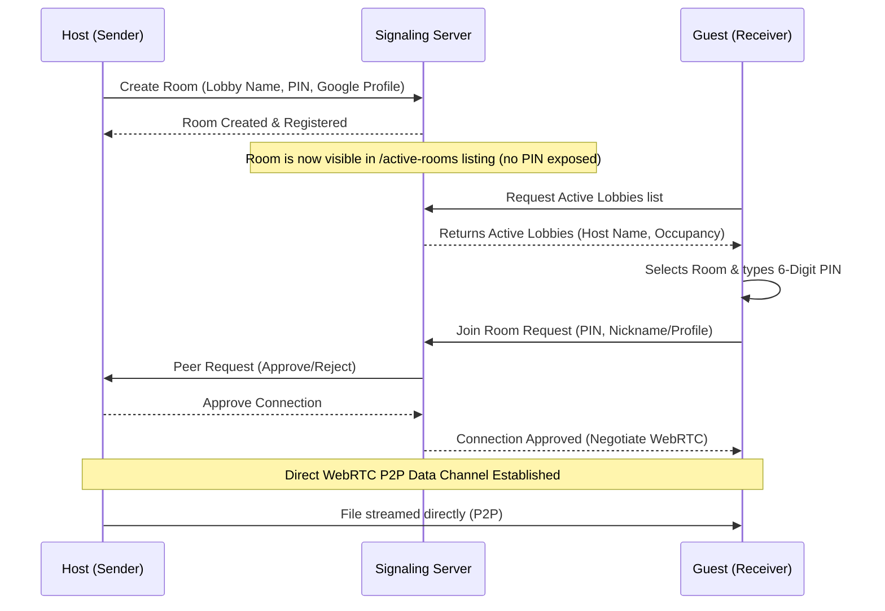

# DropStrike ⚡

DropStrike is a premium, high-speed, peer-to-peer (P2P) file sharing web application inspired by multiplayer gaming lobby mechanics. It allows users to create private transfer rooms, view online lobbies, and share files directly between devices (bypassing middleman cloud servers entirely) using WebRTC and WebSockets.

---

## 🚀 Key Features

* **Gaming-Lobby Metaphor**: Senders can create custom transfer lobbies with custom names, player limits, and session expiration timers.
* **Active Lobbies Browser**: Receivers see a live dashboard displaying all online rooms. They select a lobby and enter a secure 6-digit PIN to establish connection.
* **Pure P2P Pipeline**: Utilizes WebRTC `RTCPeerConnection` and `RTCDataChannel` to stream files directly from device to device. Since files never touch a middleman server, transfers are 100% private and run at maximum hardware speed.
* **Seamless Google Sign-In**: Integrated with Google Identity Services OAuth 2.0. Utilizes a custom-styled capsule button that preserves the application's clean design.
* **Clean Modern Aesthetics**: Designed with a pure solid white canvas, rounded geometric **Outfit** typography for layouts, and high-readability **Plus Jakarta Sans** for action buttons.
* **Persistent Sessions**: Login states are securely cached, preventing logged-out states upon page reloads.

---

## 🛠️ Technology Stack

* **Frontend**: Vanilla HTML5, Vanilla CSS3 (custom design system), JavaScript (ES6+).
* **Backend**: Node.js, Express (API endpoints, public lobbies listing).
* **Signaling**: Socket.io (WebSocket library for real-time signaling negotiation).
* **Connection**: WebRTC (direct data streaming channels).

---

## 📦 Project Structure

```
├── public/
│   ├── index.html     # Core HTML markup and view structures
│   ├── style.css      # Premium custom design system and layout stylesheets
│   └── app.js         # Client-side WebRTC logic, UI routing, and socket signaling
├── server.js          # Node.js + Express WebSocket signaling server
├── package.json       # Dependencies and npm scripts
└── README.md          # Project description and documentation
```

---

## ⚙️ How It Works


